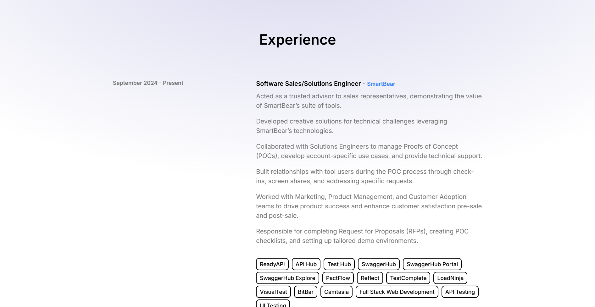

# <h1 align="center">My Portfolio</h1>

#### <h3 align="center"><a href="https://nickldimartino.github.io/portfolio/">Github Pages Site</a></h3>

 
  
 

## 📝 Description

Welcome to my online portfolio! Using React + Vite, JavaScript, and Tailwind CSS, this is a visual representation of my resume. Have fun checking it out and I hope to talk to you soon!

## 🖼️ Screenshots

 
 📊 Sections

 
 | Description | Screenshot |
 |------------ | ------------|
 | <h3 align="center">Profile Picture</h3> | 
 | <h3 align="center">Hero Page</h3> | 
 | <h3 align="center">About</h3> | 
 | <h3 align="center">Technologies</h3> | 
 | <h3 align="center">Experience</h3> | 
 | <h3 align="center">Projects</h3> | 
 | <h3 align="center">Certifications</h3> | 
 | <h3 align="center">Contat</h3> | 
 

## 💻 Technologies Used

## ⚛️ Getting Started

### 📲 Instructions

How to Navigate the App

1. Use the Navigation Bar or scroll to view each section.

2. Click the social media icons to visit their respective pages.

3. In the Experience and Certifications section, the company names are links to their respective websites.

4. In the Projects section, the View Page and Source Code links will open their respective pages.

5. In the Contact section, my email will link to your computer's default mailing application.

### 🔗 Links

Github Pages Link

<a href="https://nickldimartino.github.io/portfolio/">https://nickldimartino.github.io/portfolio/</a>

## ⏭️ Next Steps

- [ ] Find and fix possible bugs
- [ ] Refactor code
- [ ] Add more information as I progress in my career
